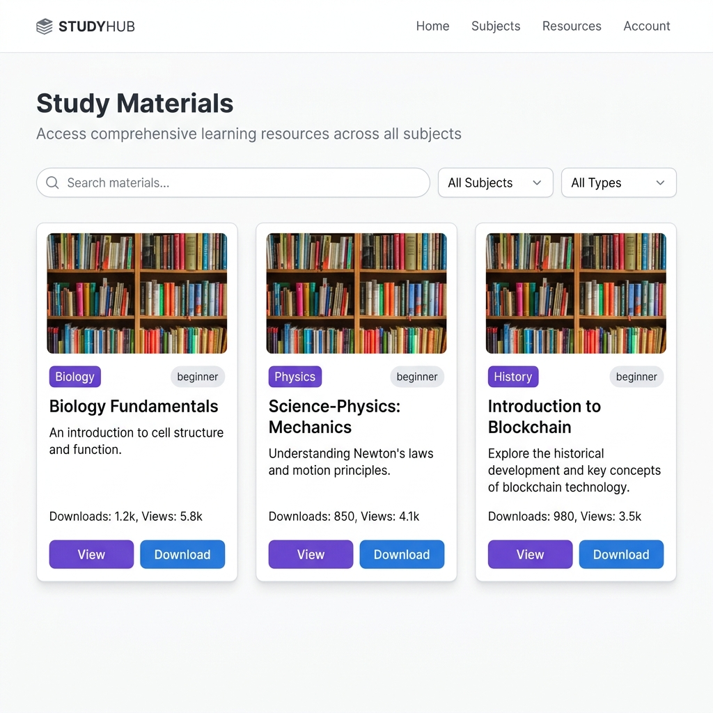

<div align="center">

# 🎓 KnowledgeHub

### *Where Learning Meets Innovation*

**A full-stack, AI-powered education platform connecting students with teachers through live tutoring, intelligent chat, and curated study materials.**

<br/>

[](https://nodejs.org/)
[](https://expressjs.com/)
[](https://react.dev/)
[](https://www.typescriptlang.org/)
[](https://www.mongodb.com/)
[](https://socket.io/)
[](https://vitejs.dev/)
[](https://tailwindcss.com/)

<br/>

[](https://project-saoui.vercel.app)
[](LICENSE)
[](CONTRIBUTING.md)
[]()

**🌐 [Live Demo → project-saoui.vercel.app](https://project-saoui.vercel.app)**

</div>

---

## 📋 Table of Contents

- [Overview](#-overview)
- [✨ Features](#-features)
- [🛠️ Tech Stack](#️-tech-stack)
- [📁 Project Structure](#-project-structure)
- [⚙️ Installation](#️-installation)
- [🚀 Usage](#-usage)
- [🔐 Environment Variables](#-environment-variables)
- [📡 API Documentation](#-api-documentation)
- [🖼️ Screenshots](#️-screenshots)
- [🗺️ Roadmap](#️-roadmap)
- [🤝 Contributing](#-contributing)
- [📜 License](#-license)
- [👤 Author](#-author)
- [🙏 Acknowledgments](#-acknowledgments)

---

## 🌟 Overview

**KnowledgeHub** is a modern, full-stack online learning platform that bridges the gap between students and educators. Built with a real-time-first architecture, it empowers teachers to share knowledge and enables students to learn more effectively through intelligent tools.

> 💡 **Why KnowledgeHub?** Traditional e-learning platforms lack real-time interaction and personalized AI assistance. KnowledgeHub solves this with integrated live video tutoring, AI-powered chat, and a centralized resource hub — all in one seamless experience.

### Who is it for?

| 🎓 Students | 👨‍🏫 Teachers |
|---|---|
| Find verified tutors by subject | Manage their own booking schedule |
| Access curated study materials | Upload and share resources |
| Chat with an AI study assistant | Conduct live video sessions |
| Book and rate tutoring sessions | Track student progress & notifications |

---

## ✨ Features

### 🤖 AI-Powered Study Assistant
- Chat with an intelligent AI tutor (powered by **OpenAI GPT** or **Groq / LLaMA 3**)
- Persistent conversation history across sessions
- Context-aware responses tailored to the learning environment
- Seamless provider fallback (OpenAI → Groq)

### 📹 Live Video Tutoring
- Peer-to-peer video sessions via **WebRTC** with Socket.io signaling
- Real-time in-session chat alongside the video stream
- Multi-participant room support with join/leave notifications
- ICE candidate negotiation for robust connectivity

### 📚 Study Materials Hub
- Teachers can **upload PDFs, notes, and videos** per subject/grade
- Students can **search, filter, download** and track popular materials
- View & download counters for popularity-based discovery
- Full CRUD management for teachers over their own content

### 📅 Booking & Session Management
- Students browse and **book available tutors** by subject
- Teachers **accept, reject, or complete** sessions with one click
- Post-session **rating & feedback system** (1–5 stars)
- Automated **in-app notifications** triggered on every booking event

### 🔐 Secure Authentication
- Role-based access control (**Student** vs **Teacher** roles)
- Session-based auth with **MongoDB-backed session store**
- Password reset via **email token** (Nodemailer)
- Secure cookies with `httpOnly`, `sameSite`, and `secure` flags

### 🔔 Real-Time Notifications
- Instant notifications for booking events (new request, confirmed, rejected, completed)
- Persistent notification store in MongoDB
- Priority-based notification system (`high` / `medium` / `low`)

---

## 🛠️ Tech Stack

### Frontend

| Technology | Purpose |
|---|---|
| **React 18** | UI component framework |
| **TypeScript** | Type-safe development |
| **Vite** | Lightning-fast build tool & dev server |
| **Tailwind CSS** | Utility-first styling |
| **Framer Motion** | Smooth page & component animations |
| **React Router DOM v7** | Client-side routing |
| **Socket.io Client** | Real-time bidirectional communication |
| **Lucide React** | Beautiful, consistent icon set |
| **React Markdown** | Render AI responses as rich markdown |

### Backend

| Technology | Purpose |
|---|---|
| **Node.js + Express** | REST API server |
| **MongoDB + Mongoose** | Persistent data storage |
| **Socket.io** | WebRTC signaling & real-time messaging |
| **OpenAI SDK** | GPT-based AI chat completions |
| **Groq SDK** | Ultra-fast LLaMA 3 inference fallback |
| **express-session + connect-mongo** | Secure session management |
| **Multer** | File upload handling |
| **Nodemailer** | Email delivery (password reset) |
| **bcryptjs** | Password hashing |

---

## 📁 Project Structure

```
KnowledgeHub/
├── backend/                    # Express.js API server
│   ├── models/                 # Mongoose schemas
│   │   ├── Booking.js          # Session booking model
│   │   ├── Chat.js             # AI chat session model
│   │   ├── Notification.js     # Notification model
│   │   ├── Student.js          # Student profile model
│   │   ├── StudyMaterial.js    # Study resource model
│   │   └── Teacher.js          # Teacher profile model
│   ├── routes/                 # REST API route handlers
│   │   ├── auth.js             # Authentication (login, signup, reset)
│   │   ├── booking.js          # Session booking management
│   │   ├── chat.js             # AI chat integration (OpenAI/Groq)
│   │   ├── notifications.js    # Notification CRUD
│   │   ├── student.js          # Student profile & dashboard
│   │   ├── studyMaterials.js   # File upload & resource management
│   │   └── teacher.js          # Teacher profile & management
│   ├── .env                    # Backend environment variables (not committed)
│   └── index.js                # App entry point, Socket.io server
│
├── frontend/                   # React + TypeScript SPA
│   ├── src/
│   │   ├── components/         # All UI components
│   │   │   ├── AIChat.tsx          # AI study assistant interface
│   │   │   ├── LiveTutoring.tsx    # Live session room browser
│   │   │   ├── LiveVideoChat.tsx   # WebRTC video session component
│   │   │   ├── StudentDashboard.tsx# Student home & bookings
│   │   │   ├── TeacherDashboard.tsx# Teacher home & management
│   │   │   ├── StudyMaterials.tsx  # Resource browser & uploader
│   │   │   ├── Login.tsx           # Authentication form
│   │   │   ├── SignUp.tsx          # Registration form
│   │   │   └── ...                 # Header, Hero, ProtectedRoute, etc.
│   │   ├── App.tsx             # Root component & routing
│   │   └── main.tsx            # React app entry point
│   ├── index.html
│   └── vite.config.ts
│
├── uploads/                    # Server-stored user-uploaded files
├── start-backend.bat           # Windows: start backend script
├── start-frontend.bat          # Windows: start frontend script
├── start-servers.ps1           # Windows PowerShell: start both servers
└── package.json                # Root workspace config
```

---

## ⚙️ Installation

### Prerequisites

Make sure you have the following installed:

- **Node.js** v18+ — [Download](https://nodejs.org/)
- **MongoDB** (local or [MongoDB Atlas](https://www.mongodb.com/cloud/atlas) cloud)
- **npm** v9+

### 1. Clone the Repository

```bash
git clone https://github.com/your-username/KnowledgeHub.git
cd KnowledgeHub
```

### 2. Install Backend Dependencies

```bash
cd backend
npm install
```

### 3. Install Frontend Dependencies

```bash
cd ../frontend
npm install
```

### 4. Configure Environment Variables

See the [Environment Variables](#-environment-variables) section below and create `backend/.env`.

### 5. Start the Development Servers

**Option A — PowerShell (Windows, runs both servers together):**
```powershell
.\start-servers.ps1
```

**Option B — Run separately:**

```bash
# Terminal 1 — Backend
cd backend
node index.js

# Terminal 2 — Frontend
cd frontend
npm run dev
```

The app will be available at:
- **Frontend:** `http://localhost:5173`
- **Backend API:** `http://localhost:5000`

---

## 🚀 Usage

### For Students

1. **Sign up** as a student and log in
2. Browse the **Study Materials** hub to find resources by subject/grade
3. Use the **AI Chat** to ask questions and get tutored by the AI assistant
4. Go to **Live Tutoring** → find available teachers → **Book a session**
5. After your session, leave a **rating and feedback** for the teacher

### For Teachers

1. **Sign up** as a teacher and complete your profile (subjects, hourly rate, bio)
2. Open your **Teacher Dashboard** to view incoming booking requests
3. **Accept or reject** session requests and provide meeting links
4. **Upload study materials** (PDFs, notes, videos) for your students
5. Mark sessions as **completed** once done and review student feedback

### Health Check

```bash
curl http://localhost:5000/api/health
# → {"status":"OK","mongo":"Connected"}
```

---

## 🔐 Environment Variables

Create a `.env` file inside the `backend/` directory with the following variables:

```env
# ── Server ──────────────────────────────────────
PORT=5000
NODE_ENV=development

# ── Database ────────────────────────────────────
MONGO_URI=mongodb://localhost:27017/knowledgehub
# Or for Atlas: mongodb+srv://<user>:<password>@cluster0.xxxxx.mongodb.net/knowledgehub

# ── Session ─────────────────────────────────────
SESSION_SECRET=your_super_secret_session_key_here

# ── CORS ────────────────────────────────────────
FRONTEND_ORIGIN=http://localhost:5173

# ── AI Provider (choose one or both) ────────────
AI_PROVIDER=groq           # "openai" or "groq"

OPENAI_API_KEY=sk-...      # Optional: OpenAI API key
OPENAI_MODEL=gpt-3.5-turbo
OPENAI_TEMPERATURE=0.7
OPENAI_MAX_TOKENS=1024

GROQ_API_KEY=gsk_...       # Optional: Groq API key (free tier available)
GROQ_MODEL=llama-3.1-8b-instant
GROQ_TEMPERATURE=0.7
GROQ_MAX_TOKENS=1024

# ── Email (for password reset) ──────────────────
EMAIL_HOST=smtp.gmail.com
EMAIL_PORT=587
EMAIL_USER=your_email@gmail.com
EMAIL_PASS=your_app_password
```

> ⚠️ **Never commit your `.env` file.** It is already listed in `.gitignore`.

> 💡 **AI Keys:** You only need **one** of `OPENAI_API_KEY` or `GROQ_API_KEY`. Groq offers a generous free tier — great for getting started quickly.

---

## 📡 API Documentation

### Authentication — `/api/auth`

| Method | Endpoint | Description | Auth Required |
|--------|----------|-------------|---------------|
| `POST` | `/register` | Register a new user (student or teacher) | ❌ |
| `POST` | `/login` | Log in and create a session | ❌ |
| `POST` | `/logout` | Destroy the current session | ✅ |
| `GET`  | `/me` | Fetch the current authenticated user | ✅ |
| `POST` | `/forgot-password` | Send a password reset email | ❌ |
| `POST` | `/reset-password/:token` | Reset password with a valid token | ❌ |

### Bookings — `/api/booking`

| Method | Endpoint | Description | Auth Required |
|--------|----------|-------------|---------------|
| `GET`  | `/` | List all bookings for the current user | ✅ |
| `GET`  | `/teachers` | List available teachers (students only) | ✅ Student |
| `POST` | `/book` | Create a new booking request | ✅ Student |
| `PUT`  | `/:id/accept` | Accept a booking (with optional meeting link) | ✅ Teacher |
| `PUT`  | `/:id/reject` | Reject a booking with a reason | ✅ Teacher |
| `PUT`  | `/:id/complete` | Mark a session as completed | ✅ Teacher |
| `POST` | `/:id/rate` | Rate a completed session (1–5 stars) | ✅ Student |

### AI Chat — `/api/chat`

| Method | Endpoint | Description |
|--------|----------|-------------|
| `POST` | `/` | Send a message and get an AI response |
| `GET`  | `/history/:sessionId` | Retrieve messages for a session |
| `GET`  | `/sessions/:userId` | List all chat sessions for a user |
| `DELETE` | `/session/:sessionId` | Delete a specific chat session |

### Study Materials — `/api/study-materials`

| Method | Endpoint | Description | Auth Required |
|--------|----------|-------------|---------------|
| `GET`  | `/` | List all public materials (supports `?subject`, `?grade`, `?type`, `?search`) | ❌ |
| `POST` | `/` | Upload a new material (multipart/form-data) | ✅ Teacher |
| `GET`  | `/:id` | Get a specific material by ID | ❌ |
| `PUT`  | `/:id` | Update material metadata | ✅ Teacher (owner) |
| `DELETE` | `/:id` | Delete a material | ✅ Teacher (owner) |
| `POST` | `/:id/view` | Increment the view counter | ❌ |
| `GET`  | `/:id/download` | Get the download URL & increment counter | ❌ |

### Notifications — `/api/notifications`

| Method | Endpoint | Description | Auth Required |
|--------|----------|-------------|---------------|
| `GET`  | `/` | Get all notifications for the current user | ✅ |
| `PUT`  | `/:id/read` | Mark a notification as read | ✅ |
| `DELETE` | `/:id` | Delete a notification | ✅ |

### Health Check — `/api/health`

```
GET /api/health
→ { "status": "OK", "mongo": "Connected" }
```

---

## 🖼️ Screenshots

### 🏠 Landing Page — Hero


### 🎓 Student Dashboard


### 🤖 AI Chat Assistant


### 👨‍🏫 Teacher Dashboard


### 📚 Study Materials Hub


> 💡 Replace images in `docs/screenshots/` with your own actual screenshots at any time.

---

## 🗺️ Roadmap

### ✅ Completed (v1.0)
- [x] Role-based authentication (Student / Teacher)
- [x] AI-powered chat assistant (OpenAI + Groq)
- [x] WebRTC peer-to-peer live video tutoring
- [x] Session booking & management with notifications
- [x] Study material upload, search & download
- [x] Post-session rating & feedback system
- [x] Persistent AI chat history
- [x] Password reset via email

### 🔄 In Progress (v1.1)
- [ ] Stripe payment integration for paid tutoring sessions
- [ ] Teacher availability calendar / scheduling
- [ ] Admin dashboard for platform management

### 🔮 Planned (v2.0)
- [ ] Mobile application (React Native)
- [ ] AI-generated quiz/flashcard creation from uploaded materials
- [ ] Group live tutoring sessions (multi-student rooms)
- [ ] Certificate generation for completed courses
- [ ] Teacher verification and review system
- [ ] Analytics dashboard for teachers (student engagement, session stats)
- [ ] Dark mode toggle

---

## 🤝 Contributing

Contributions are what make the open-source community such an amazing place to learn and grow. Any contributions you make are **greatly appreciated**!

### How to Contribute

1. **Fork** the repository
2. **Create** a new branch for your feature:
   ```bash
   git checkout -b feature/your-amazing-feature
   ```
3. **Commit** your changes with a clear message:
   ```bash
   git commit -m "feat: add amazing feature"
   ```
4. **Push** the branch to GitHub:
   ```bash
   git push origin feature/your-amazing-feature
   ```
5. **Open a Pull Request** and describe your changes in detail

### Commit Message Convention

This project follows [Conventional Commits](https://www.conventionalcommits.org/):

| Prefix | Usage |
|--------|-------|
| `feat:` | A new feature |
| `fix:` | A bug fix |
| `docs:` | Documentation changes only |
| `style:` | Formatting, no logic change |
| `refactor:` | Code refactoring |
| `test:` | Adding or updating tests |
| `chore:` | Build process or tooling changes |

### Code Style

- **Frontend:** Follow the existing ESLint config (`eslint.config.js`)
- **Backend:** Use ES Modules (`import`/`export`) — the project uses `"type": "module"`
- Run `npm run lint` in the frontend before submitting a PR

### Reporting Bugs

Found a bug? Please [open an issue](https://github.com/your-username/KnowledgeHub/issues/new) with:
- A clear description of the problem
- Steps to reproduce
- Expected vs. actual behavior
- Screenshots if applicable

---

## 📜 License

Distributed under the **MIT License**. See [`LICENSE`](LICENSE) for more information.

```
MIT License — Copyright (c) 2026 KnowledgeHub Contributors

Permission is hereby granted, free of charge, to any person obtaining a copy
of this software... (see LICENSE file for full text)
```

---

## 👤 Author

**Meet Patel**

- 🌐 Portfolio: 
- 🐙 GitHub: [GitHub](https://github.com/MeetOp08)
- 💼 LinkedIn: [LinkedIn](https://linkedin.com/in/meet-patel-42a596277)
- 📧 Email: [patelmeet52271@gmail.com](mailto:patelmeet52271@gmail.com)
- 🚀 Live Demo: [project-saoui.vercel.app](https://project-saoui.vercel.app)

---

## 🙏 Acknowledgments

This project was built standing on the shoulders of giants. Special thanks to:

- **[OpenAI](https://openai.com/)** — GPT models powering the AI study assistant
- **[Groq](https://groq.com/)** — Ultra-fast LLaMA 3 inference for free-tier AI support
- **[Socket.io](https://socket.io/)** — Making real-time communication effortless
- **[MongoDB Atlas](https://www.mongodb.com/cloud/atlas)** — Reliable cloud database
- **[Vercel](https://vercel.com/)** — Seamless frontend deployment
- **[Lucide Icons](https://lucide.dev/)** — Beautiful open-source icon library
- **[Framer Motion](https://www.framer.com/motion/)** — Buttery-smooth animations
- The incredible open-source community ❤️

---

<div align="center">

**⭐ Star this repo if you found it helpful!**

*Built with passion for education and open-source*

</div>
