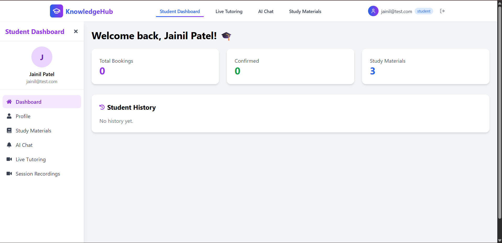
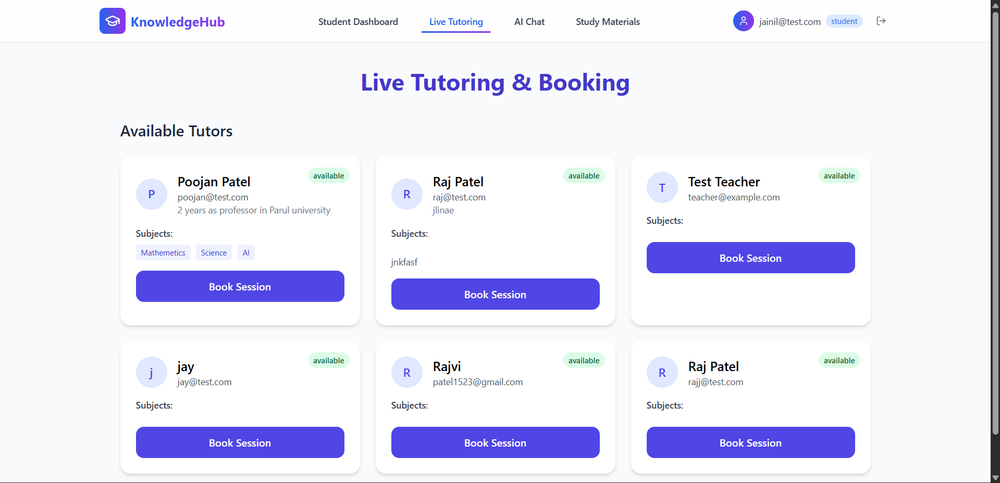
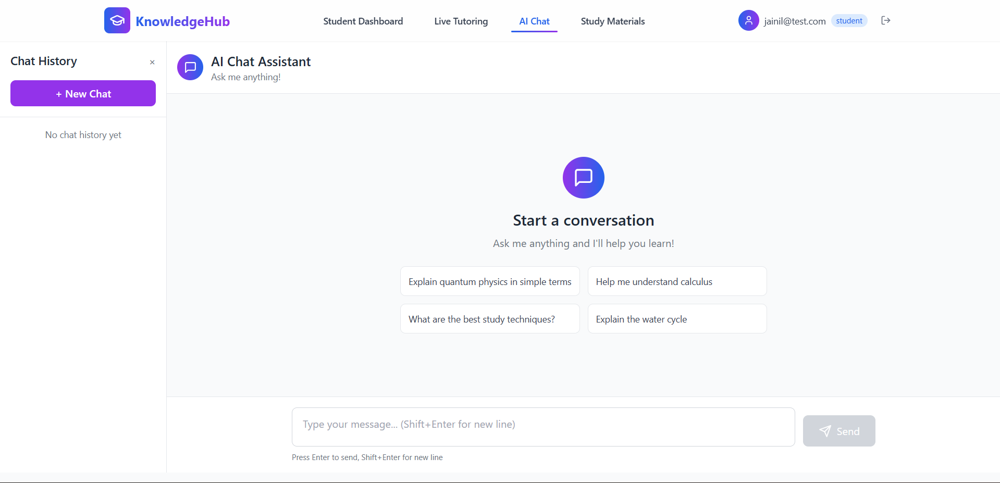
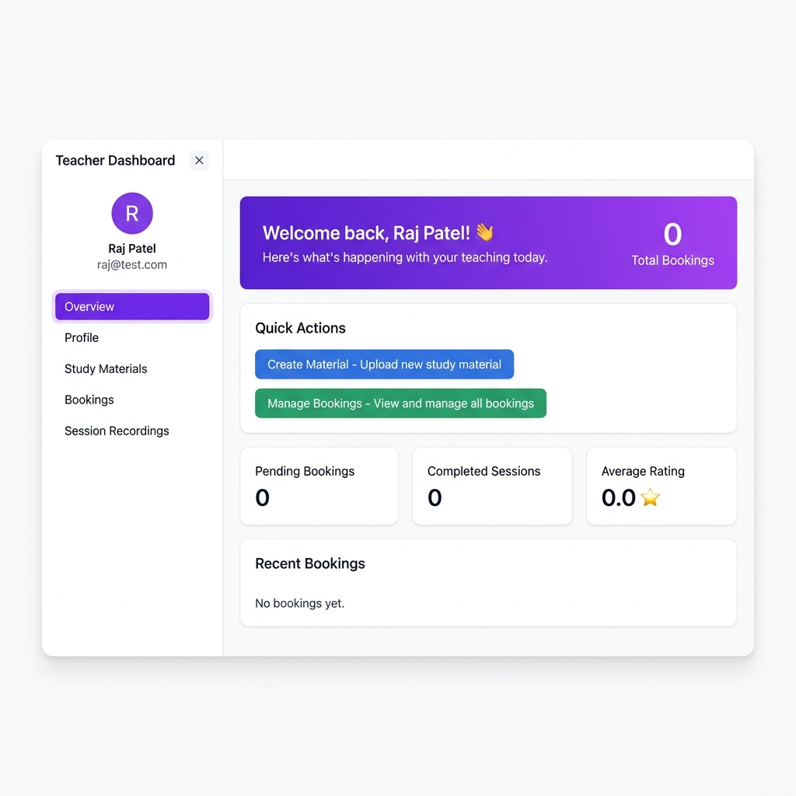
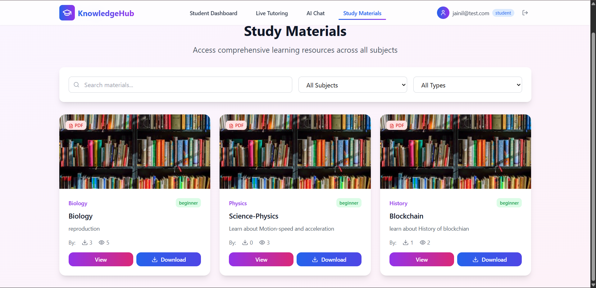

<div align="center">

# KnowledgeHub

### *Where Learning Meets Innovation*

**A full-stack, AI-powered education platform connecting students with teachers through live tutoring, intelligent chat, and curated study materials.**

<br/>

[](https://nodejs.org/)
[](https://expressjs.com/)
[](https://react.dev/)
[](https://www.typescriptlang.org/)
[](https://www.mongodb.com/)
[](https://socket.io/)
[](https://vitejs.dev/)
[](https://tailwindcss.com/)

<br/>

[](https://project-saoui.vercel.app)
[](LICENSE)
[](CONTRIBUTING.md)

**[Live Demo → project-saoui.vercel.app](https://project-saoui.vercel.app)**

</div>

---

## Overview

**KnowledgeHub** is a modern, full-stack online learning platform that bridges the gap between students and educators. Built with a real-time-first architecture, it empowers teachers to share knowledge and enables students to learn more effectively through intelligent tools.

Traditional e-learning platforms lack real-time interaction and personalized AI assistance. KnowledgeHub solves this with integrated live video tutoring, AI-powered chat, and a centralized resource hub — all in one seamless experience.

### Who is it for?

| Students | Teachers |
|---|---|
| Find verified tutors by subject | Manage their own booking schedule |
| Access curated study materials | Upload and share resources |
| Chat with an AI study assistant | Conduct live video sessions |
| Book and rate tutoring sessions | Track student progress & notifications |

---

## Features

### AI-Powered Study Assistant
- Chat with an intelligent AI tutor (powered by **OpenAI GPT** or **Groq / LLaMA 3**)
- Persistent conversation history across sessions
- Context-aware responses tailored to the learning environment
- Seamless provider fallback (OpenAI → Groq)

### Live Video Tutoring
- Peer-to-peer video sessions via **WebRTC** with Socket.io signaling
- Real-time in-session chat alongside the video stream
- Multi-participant room support with join/leave notifications
- ICE candidate negotiation for robust connectivity

### Study Materials Hub
- Teachers can **upload PDFs, notes, and videos** per subject/grade
- Students can **search, filter, download** and track popular materials
- View & download counters for popularity-based discovery
- Full CRUD management for teachers over their own content

### Booking & Session Management
- Students browse and **book available tutors** by subject
- Teachers **accept, reject, or complete** sessions with one click
- Post-session **rating & feedback system** (1–5 stars)
- Automated in-app notifications triggered on every booking event

### Secure Authentication
- Role-based access control (**Student** vs **Teacher** roles)
- Session-based auth with **MongoDB-backed session store**
- Password reset via **email token** (Nodemailer)
- Secure cookies with `httpOnly`, `sameSite`, and `secure` flags

### Real-Time Notifications
- Instant notifications for booking events (new request, confirmed, rejected, completed)
- Persistent notification store in MongoDB
- Priority-based notification system

---

## Tech Stack

### Frontend

| Technology | Purpose |
|---|---|
| **React 18** | UI component framework |
| **TypeScript** | Type-safe development |
| **Vite** | Lightning-fast build tool & dev server |
| **Tailwind CSS** | Utility-first styling |
| **Framer Motion** | Smooth page & component animations |
| **React Router DOM v7** | Client-side routing |
| **Socket.io Client** | Real-time bidirectional communication |
| **Lucide React** | Icon set |
| **React Markdown** | Render AI responses as rich markdown |

### Backend

| Technology | Purpose |
|---|---|
| **Node.js + Express** | REST API server |
| **MongoDB + Mongoose** | Persistent data storage |
| **Socket.io** | WebRTC signaling & real-time messaging |
| **OpenAI SDK** | GPT-based AI chat completions |
| **Groq SDK** | Ultra-fast LLaMA 3 inference fallback |
| **express-session + connect-mongo** | Secure session management |
| **Multer** | File upload handling |
| **Nodemailer** | Email delivery (password reset) |
| **bcryptjs** | Password hashing |

---

## Project Structure

```
KnowledgeHub/
├── backend/                    # Express.js API server
│   ├── models/                 # Mongoose schemas
│   │   ├── Booking.js
│   │   ├── Chat.js
│   │   ├── Notification.js
│   │   ├── Student.js
│   │   ├── StudyMaterial.js
│   │   └── Teacher.js
│   ├── routes/                 # REST API route handlers
│   │   ├── auth.js             # Authentication (login, signup, reset)
│   │   ├── booking.js          # Session booking management
│   │   ├── chat.js             # AI chat integration (OpenAI/Groq)
│   │   ├── notifications.js
│   │   ├── student.js
│   │   ├── studyMaterials.js   # File upload & resource management
│   │   └── teacher.js
│   ├── .env                    # Environment variables (not committed)
│   └── index.js                # App entry point, Socket.io server
│
├── frontend/                   # React + TypeScript SPA
│   ├── src/
│   │   ├── components/
│   │   │   ├── AIChat.tsx
│   │   │   ├── LiveTutoring.tsx
│   │   │   ├── LiveVideoChat.tsx
│   │   │   ├── StudentDashboard.tsx
│   │   │   ├── TeacherDashboard.tsx
│   │   │   ├── StudyMaterials.tsx
│   │   │   ├── Login.tsx
│   │   │   ├── SignUp.tsx
│   │   │   └── ...
│   │   ├── App.tsx
│   │   └── main.tsx
│   └── vite.config.ts
│
├── uploads/                    # Server-stored user-uploaded files
├── docs/screenshots/           # README screenshots
└── package.json
```

---

## Installation

### Prerequisites

- **Node.js** v18+ — [Download](https://nodejs.org/)
- **MongoDB** (local or [MongoDB Atlas](https://www.mongodb.com/cloud/atlas))
- **npm** v9+

### Steps

```bash
# 1. Clone the repository
git clone https://github.com/MeetOp08/KnowledgeHub.git
cd KnowledgeHub

# 2. Install backend dependencies
cd backend
npm install

# 3. Install frontend dependencies
cd ../frontend
npm install

# 4. Create backend/.env with your config (see below)

# 5a. Start both servers (Windows PowerShell)
.\start-servers.ps1

# 5b. Or run separately
# Terminal 1 — Backend
cd backend && node index.js

# Terminal 2 — Frontend
cd frontend && npm run dev
```

The app will be available at:
- **Frontend:** `http://localhost:5173`
- **Backend API:** `http://localhost:5000`

### Required Environment Variables

Create `backend/.env`:

```env
PORT=5000
MONGO_URI=mongodb://localhost:27017/knowledgehub
SESSION_SECRET=your_secret_here
FRONTEND_ORIGIN=http://localhost:5173

# At least one AI key is required
GROQ_API_KEY=gsk_...
OPENAI_API_KEY=sk-...
AI_PROVIDER=groq

# Email (for password reset)
EMAIL_HOST=smtp.gmail.com
EMAIL_USER=your_email@gmail.com
EMAIL_PASS=your_app_password
```

---

## Usage

### For Students

1. Sign up as a student and log in
2. Browse the **Study Materials** hub to find resources by subject/grade
3. Use **AI Chat** to ask questions and get tutored by the AI assistant
4. Go to **Live Tutoring** → find available teachers → **Book a session**
5. After your session, leave a rating and feedback for the teacher

### For Teachers

1. Sign up as a teacher and complete your profile (subjects, hourly rate, bio)
2. Open your **Teacher Dashboard** to view incoming booking requests
3. Accept or reject session requests and provide meeting links
4. **Upload study materials** (PDFs, notes, videos) for your students
5. Mark sessions as **completed** once done and review student feedback

---

## Screenshots

### Landing Page


### Student Dashboard


### Live Tutoring & Booking


### AI Chat Assistant


### Teacher Dashboard


### Study Materials Hub


---

## Roadmap

### Completed (v1.0)
- [x] Role-based authentication (Student / Teacher)
- [x] AI-powered chat assistant (OpenAI + Groq)
- [x] WebRTC peer-to-peer live video tutoring
- [x] Session booking & management with notifications
- [x] Study material upload, search & download
- [x] Post-session rating & feedback system
- [x] Persistent AI chat history
- [x] Password reset via email

### In Progress (v1.1)
- [ ] Stripe payment integration for paid tutoring sessions
- [ ] Teacher availability calendar / scheduling
- [ ] Admin dashboard for platform management

### Planned (v2.0)
- [ ] Mobile application (React Native)
- [ ] AI-generated quiz/flashcard creation from uploaded materials
- [ ] Group live tutoring sessions (multi-student rooms)
- [ ] Certificate generation for completed courses
- [ ] Analytics dashboard for teachers

---

## Contributing

Contributions are welcome! Any contributions you make are **greatly appreciated**.

1. Fork the repository
2. Create a new branch: `git checkout -b feature/your-feature`
3. Commit your changes: `git commit -m "feat: add your feature"`
4. Push the branch: `git push origin feature/your-feature`
5. Open a Pull Request

### Commit Convention

| Prefix | Usage |
|--------|-------|
| `feat:` | A new feature |
| `fix:` | A bug fix |
| `docs:` | Documentation only |
| `refactor:` | Code refactoring |
| `chore:` | Build/tooling changes |

Found a bug? [Open an issue](https://github.com/MeetOp08/KnowledgeHub/issues/new) with steps to reproduce.

---

## License

Distributed under the **MIT License**. See [`LICENSE`](LICENSE) for more information.

---

## Author

**Meet Patel**

- GitHub: [@MeetOp08](https://github.com/MeetOp08)
- LinkedIn: [meet-patel-42a596277](https://linkedin.com/in/meet-patel-42a596277)
- Email: [patelmeet52271@gmail.com](mailto:patelmeet52271@gmail.com)
- Live Demo: [project-saoui.vercel.app](https://project-saoui.vercel.app)

---

## Acknowledgments

- **[OpenAI](https://openai.com/)** — GPT models powering the AI study assistant
- **[Groq](https://groq.com/)** — Ultra-fast LLaMA 3 inference
- **[Socket.io](https://socket.io/)** — Real-time communication
- **[MongoDB Atlas](https://www.mongodb.com/cloud/atlas)** — Cloud database
- **[Vercel](https://vercel.com/)** — Frontend deployment
- **[Lucide Icons](https://lucide.dev/)** — Icon library
- **[Framer Motion](https://www.framer.com/motion/)** — Animations

---

<div align="center">

**Star this repo if you found it helpful!**

*Built with passion for education and open-source*

</div>
